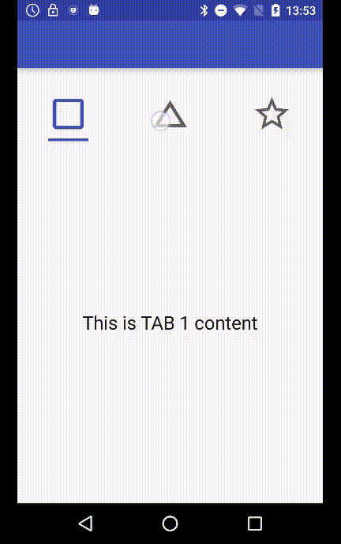

# EasyTabs

Easy implementation of custom tabs, when TabLayout do not fit your needs.

### Installation

Add the jitpack source in your root build.gradle at the end of repositories:

    allprojects {
        repositories {
            ...
            maven { url 'https://jitpack.io' }
        }
    }

Add the dependency in your app gradle :    

    implementation 'com.github.loicteillard:EasyTabs:0.4'  

### Usage

1 - Include EasyTabs namespace to the root element :  

    xmlns:easytabs="http://schemas.android.com/apk/res-auto"

2 - Add the EasyTabs ViewGroup and Views for tabs title and a ViewPager to interact with, here is a full layout example :
Views can be :
TextView
EasyTabTextView
ImageView 

    <?xml version="1.0" encoding="utf-8"?>
    <LinearLayout
        android:id="@+id/activity_easy_tab_text"
        xmlns:android="http://schemas.android.com/apk/res/android"
        xmlns:easytabs="http://schemas.android.com/apk/res-auto"
        android:layout_width="match_parent"
        android:layout_height="match_parent"
        android:orientation="vertical"
        >
        <com.loicteillard.easytabs.EasyTabs
            android:id="@+id/easytabs"
            android:layout_width="match_parent"
            android:layout_height="wrap_content"
            android:layout_marginTop="30dp"
            easytabs:etab_selected_color="@color/md_deep_orange_A200"
            easytabs:etab_unselected_color="@color/md_grey_700"
            easytabs:etab_bold_for_selected="true"
            easytabs:etab_separators="false"
            >
            <com.loicteillard.easytabs.EasyTabTextView
                android:layout_width="wrap_content"
                android:layout_height="wrap_content"
                android:text="@string/tab_1"
                android:textAllCaps="true"
                />
            <com.loicteillard.easytabs.EasyTabTextView
                android:layout_width="wrap_content"
                android:layout_height="wrap_content"
                android:text="@string/tab_2"
                android:textAllCaps="true"
                easytabs:etab_selected_color="@color/md_light_blue_500"
                />
            <com.loicteillard.easytabs.EasyTabTextView
                android:layout_width="wrap_content"
                android:layout_height="wrap_content"
                android:text="@string/tab_3"
                android:textAllCaps="true"
                easytabs:etab_selected_color="@color/md_purple_300"
                />
        </com.loicteillard.easytabs.EasyTabs>
        <android.support.v4.view.ViewPager
            android:id="@+id/viewpager"
            android:layout_width="match_parent"
            android:layout_height="match_parent"/>
    </LinearLayout>

## Code

    EasyTabs easyTabs = findViewById(R.id.easytabs);
    ViewPager viewpager = findViewById(R.id.viewpager);
    MyFragmentAdapter pagerAdapter = new MyFragmentAdapter(getSupportFragmentManager());
    viewpager.setAdapter(pagerAdapter);

    easyTabs.setViewPager(viewpager, 0); // Set viewPager to EasyTabs with default index

    easyTabs.setPagerListener(new EasyTabs.PagerListener() { // Optional, add a listener
        @Override
        public void onTabSelected(int position) {
            Toast.makeText(MainActivity.this, "tab selected:"+position, Toast.LENGTH_SHORT).show();
        }
    });

####  Supported Attributs

| XML Attribut         | Description  |Type|
| :-------------:| :-----:|:-----:|
| easytabs:etab_selected_color| Color of Text and indicator for selected tab (global for all tabs or for one tab if needed) |Color|
| easytabs:etab_unselected_color|  Color of Text and indicator for unselected tab (global for all tabs or for one tab)|Color|
| easytabs:etab_bold_for_selected| Text is bold when selected (default is false) |Boolean|
| easytabs:etab_indicator_size|  Width of indicator, one of these values : "text" (adjust to same size of the tab text [default], "value" (custom size, add 'etab_indicator_width'), "match_parent" (full size of the tab)|Enum|
| easytabs:etab_indicator_width |If you use etab_indicator_size="value", add a fixed dimension for width indicator|Dimension|
| easytabs:etab_indicators| Enable/Disable indicators|Boolean|
| easytabs:etab_separators| Enable/Disable separators|Boolean|
| easytabs:etab_separator_color| Change color of separators|Color|
